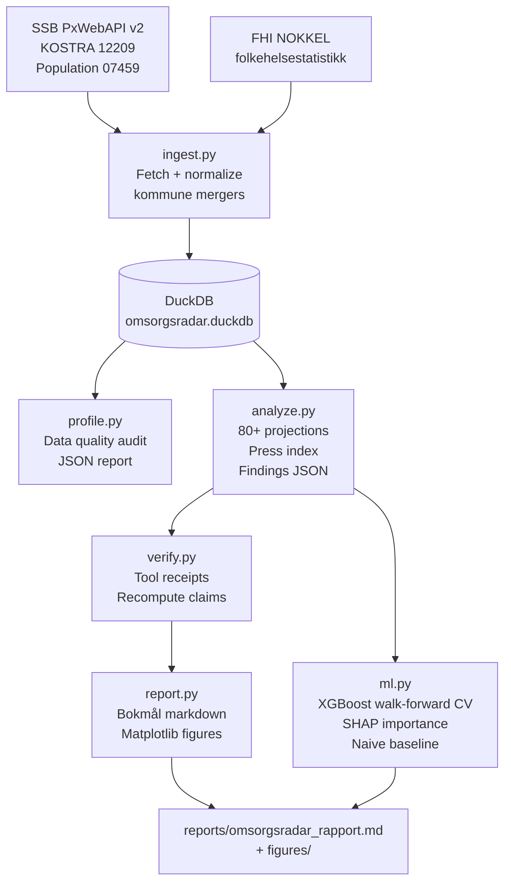

# Kommunal Omsorgsradar

**Agentic data-analysis pipeline over Norwegian open health data.**

Computes a per-municipality *press index* combining projected 80+ population growth (to 2035) with current elder-care service coverage — ranking Norwegian municipalities by the likely severity of the demographic care squeeze. All analysis is deterministic, reproducible, and fully offline-runnable. An optional LLM narration step (Anthropic API) requires a key; the full pipeline runs without one.

---

## Bokmål sammendrag

Dette prosjektet beregner en **demografisk press-indeks** per norsk kommune for perioden frem mot 2035. Indeksen kombinerer forventet vekst i befolkningen 80 år og over med dagens dekning av kommunale hjemmetjenester (KOSTRA-data, SSB). Kommuner med rask demografisk vekst og lav tjenestedekning i dag rangeres høyt — det er disse som trenger tidligst planleggingsoppmerksomhet.

Data: SSB PxWebAPI v2 (KOSTRA tabell 12209 + befolkning tabell 07459) og FHI NOKKEL (folkehelsestatistikk). Alle data er åpne og krever ingen søknadsprosess. Rapporten er på bokmål. Kildekode og pipeline er på engelsk.

**Analysen er deskriptiv, ikke kausal.** Se [`LIMITATIONS.md`](LIMITATIONS.md).

---

## Architecture



**Key design choice:** the LLM *narrates*, never *calculates*. Every statistic is computed by deterministic Python code; the verifier module recomputes every claim in the narrative from the structured findings JSON. This "tool receipts" pattern is the portfolio differentiator.

---

## Pipeline phases

| Phase | Module | What it does |
|-------|--------|-------------|
| P0 Ingest | `ingest.py` | SSB + FHI fetch, kommune merger normalization, DuckDB persistence |
| P0 Profile | `profile.py` | Data quality audit → `data/quality_profile.json` |
| P1 Analysis | `analyze.py` | 80+ projections, coverage rates, press index → `data/findings.json` |
| P2 Verify | `verify.py` | Recomputes every claimed statistic ("tool receipts") |
| P3 Report | `report.py` | Bokmål markdown + matplotlib figures |
| P4 ML | `ml.py` | XGBoost walk-forward CV + SHAP + naive baseline |

---

## Quick start

```bash
# Clone and install
git clone <repo>
cd omsorgsradar
uv sync

# Run the full pipeline (fetches real SSB data, cached after first run)
uv run python -m omsorgsradar.pipeline

# Run tests (fully offline, no API key needed)
uv run pytest

# Optional: LLM narration (requires Anthropic API key)
ANTHROPIC_API_KEY=sk-... uv run python -m omsorgsradar.pipeline
```

Output files:
- `reports/omsorgsradar_rapport.md` — bokmål report
- `reports/figures/` — matplotlib figures
- `data/findings.json` — structured analysis findings
- `data/quality_profile.json` — data quality profile
- `data/ml_results.json` — ML walk-forward CV results

---

## Data quality profile

Generated automatically by `profile.py` on the live SSB data.

### kostra_pleie
- Source: SSB KOSTRA table 12209
- Rows: 39,204
- Municipalities: 849
- Year range: 2015–2025
- Variables: % of 80+ using home services, % with institutional care, cost per resident, FTE per user

### befolkning (population 80+)
- Source: SSB table 07459 — folkemengde etter alder
- Rows: 237,750
- Municipalities: 908
- Year range: 2017–2026
- Age groups: 80–104 år (1-year classes)

### Kommune merger handling
The 2020 merger wave is handled via `kommune_mergers.py` (lookup table covering ~50 absorption events). Pre-2020 codes (e.g. old Molde 1502 → new 1506, old Trondheim 1601 → 5001) are normalized before joining. Rows with old codes that map to new codes are counted in the quality profile under `merger_adjusted_rows`. The SSB KOSTRA series already uses post-2020 codes from 2020 onward; the lookup guards against historical data joins.

---

## Key findings (real data, 2025)

Based on KOSTRA 2025 + SSB population 2026:

- **908 municipalities** ranked by press index
- **National 80+ population**: projected to grow ~36% by 2035 (using SSB 3.5% p.a. growth assumption — see LIMITATIONS)
- **Highest press**: Hasvik (Troms), Bjerkreim (Rogaland), Tydal (Trøndelag) — rapid demographic growth combined with the lowest current home-care coverage rates (~15–16% of 80+ receiving services)
- **ML**: XGBoost walk-forward CV MAE = **2.08 percentage points** vs naive baseline 2.28 pp — modest but consistent improvement; prior-year coverage (`coverage_rate_lag1`) is the dominant feature (SHAP mean |SHAP| = 5.03)

---

## ML results summary

XGBoost walk-forward CV (3 expanding windows) predicting % of 80+ using home services (Y+1):

| Fold | Test year | XGB MAE | Naive MAE |
|------|-----------|---------|-----------|
| 1 | 2023 | 2.17 pp | 2.28 pp |
| 2 | 2024 | 2.02 pp | 2.25 pp |
| 3 | 2025 | 2.05 pp | 2.30 pp |
| **Mean** | — | **2.08 pp** | **2.28 pp** |

SHAP top feature: `coverage_rate_lag1` (prior-year rate dominates). TabPFN-2.5 not run (requires interactive license sign-up — future work).

**Framing: planning support tool, not clinical decision support.**

---

## API discovery notes

Documented in [`docs/api_drift.md`](docs/api_drift.md). Key findings:
- SSB table 13873 (municipality projections) returned 400 with the public API key — fallback to table 12880 (national-level)
- FHI NOKKEL indicator endpoint (`/api/open/v1/datakilder/nokkel/indikatorer`) returns 404 — endpoint appears to have moved post-2025. FHI NOKKEL data was skipped gracefully; see LIMITATIONS.
- KOSTRA 12209 region variable code is `KOKkommuneregion0000` (not `Region`) — discovered at runtime

---

## Limitations

See [`LIMITATIONS.md`](LIMITATIONS.md).

---

## Costs

See [`COSTS.md`](COSTS.md).

---

## Author

Oleksandr Altukhov — utdannet lege (master i medisin), agentic-AI engineer.
Built with [Claude Code](https://claude.ai/code) + Claude Agent SDK.
