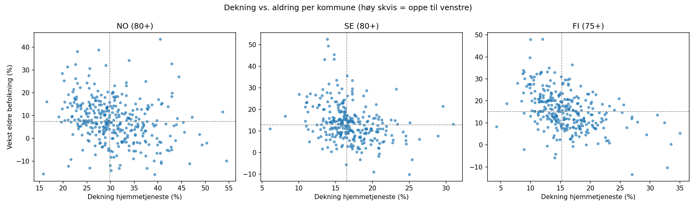
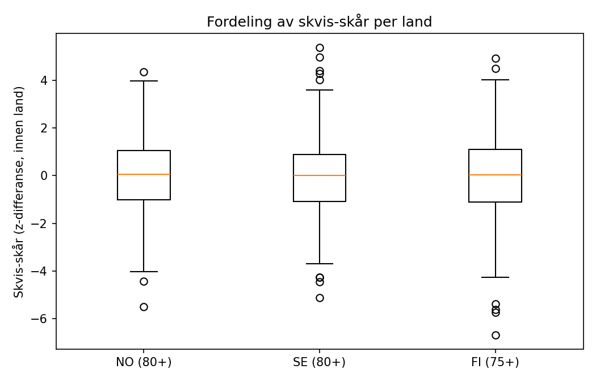
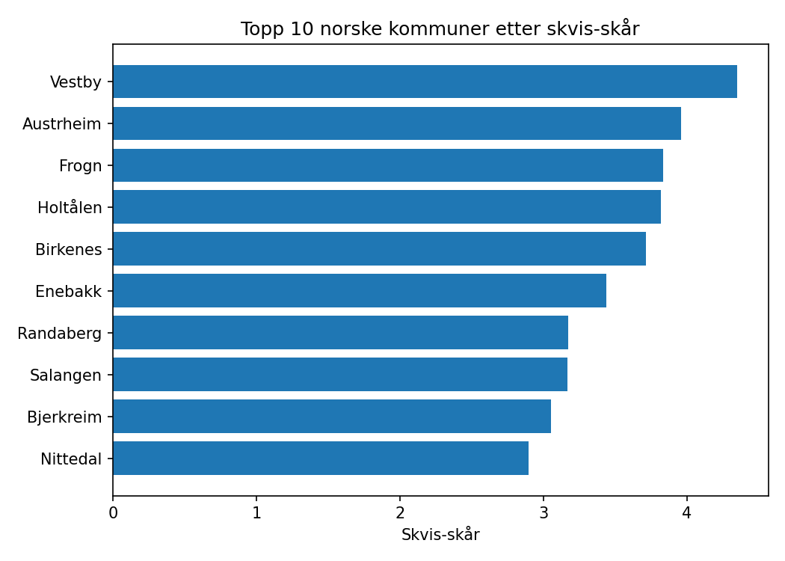

# Nordisk omsorgsradar: aldring vs. hjemmetjenestekapasitet

**Spørsmål:** Hvilke kommuner får den hardeste skvisen mellom aldring og hjemmetjenestekapasitet — og ser mønsteret bedre ut i Norge enn i Sverige og Finland?

**Metode.** For hver kommune beregner vi (1) dekning av hjemmetjenester blant
eldre, (2) prosentvis vekst i eldre befolkning 2019–2023,
og (3) en skvis-skår: z-skår for eldrevekst minus z-skår for dekning,
normalisert **innen hvert land**. Høy skår = sterk aldring kombinert med lav
dekning. Alle tall er beregnet av kode og kontrollregnet av en uavhengig
verifiseringsmodul før denne rapporten ble generert
(verifisering: 168/168 kontroller OK —
én uavhengig omregning per rangert kommune pluss nasjonale aggregater per land).

## Funn per land

### Norge (aldersgrense 80+)

346 kommuner i analysen (25 rader utelatt:
manglende/supprimerte verdier eller historiske kommunenummer). Median dekning: **29.85 %**. Median vekst i
eldre befolkning: **7.43 %**. Andel kommuner i
høy-skvis-kvadranten: **0.3064**.

| # | Kommune | Skvis | Dekning (%) | Eldrevekst (%) |
|---|---------|-------|-------------|----------------|
| 1 | Vestby (`NO-3216`) | 4.35 | 23.0 | 38.18 |
| 2 | Austrheim (`NO-4632`) | 3.963 | 20.9 | 31.34 |
| 3 | Frogn (`NO-3214`) | 3.835 | 19.8 | 28.48 |
| 4 | Holtålen (`NO-5026`) | 3.819 | 22.6 | 32.48 |
| 5 | Birkenes (`NO-4216`) | 3.716 | 27.5 | 38.75 |
| 6 | Enebakk (`NO-3220`) | 3.439 | 20.2 | 25.26 |
| 7 | Randaberg (`NO-1127`) | 3.172 | 25.6 | 30.69 |
| 8 | Salangen (`NO-5522`) | 3.168 | 22.6 | 26.21 |
| 9 | Bjerkreim (`NO-1114`) | 3.056 | 16.5 | 16.09 |
| 10 | Nittedal (`NO-3232`) | 2.899 | 23.0 | 24.21 |

### Sverige (aldersgrense 80+)

290 kommuner i analysen (0 rader utelatt:
manglende/supprimerte verdier eller historiske kommunenummer). Median dekning: **16.5 %**. Median vekst i
eldre befolkning: **12.83 %**. Andel kommuner i
høy-skvis-kvadranten: **0.3138**.

| # | Kommune | Skvis | Dekning (%) | Eldrevekst (%) |
|---|---------|-------|-------------|----------------|
| 1 | Nykvarn (`SE-0140`) | 5.356 | 13.85 | 52.57 |
| 2 | Håbo (`SE-0305`) | 4.969 | 13.99 | 49.53 |
| 3 | Värmdö (`SE-0120`) | 4.401 | 13.47 | 43.17 |
| 4 | Vaxholm (`SE-0187`) | 4.275 | 14.78 | 45.51 |
| 5 | Trosa (`SE-0488`) | 4.024 | 14.81 | 43.38 |
| 6 | Staffanstorp (`SE-1230`) | 3.583 | 10.05 | 26.98 |
| 7 | Kävlinge (`SE-1261`) | 3.17 | 11.54 | 27.28 |
| 8 | Höganäs (`SE-1284`) | 3.165 | 11.1 | 26.07 |
| 9 | Alingsås (`SE-1489`) | 3.009 | 8.14 | 16.92 |
| 10 | Linköping (`SE-0580`) | 2.953 | 6.07 | 10.97 |

### Finland (aldersgrense 75+)

299 kommuner i analysen (0 rader utelatt:
manglende/supprimerte verdier eller historiske kommunenummer). Median dekning: **15.2 %**. Median vekst i
eldre befolkning: **15.22 %**. Andel kommuner i
høy-skvis-kvadranten: **0.3144**.

| # | Kommune | Skvis | Dekning (%) | Eldrevekst (%) |
|---|---------|-------|-------------|----------------|
| 1 | Jomala (`FI-170`) | 4.912 | 10.0 | 47.89 |
| 2 | Siuntio (`FI-755`) | 4.488 | 12.0 | 48.0 |
| 3 | Järvenpää (`FI-186`) | 4.007 | 9.9 | 39.69 |
| 4 | Tuusula (`FI-858`) | 3.588 | 8.8 | 33.87 |
| 5 | Kerava (`FI-245`) | 3.476 | 8.9 | 33.07 |
| 6 | Lemland (`FI-417`) | 3.442 | 8.7 | 32.38 |
| 7 | Kontiolahti (`FI-276`) | 3.153 | 7.8 | 28.09 |
| 8 | Pirkkala (`FI-604`) | 3.121 | 9.0 | 30.12 |
| 9 | Muurame (`FI-500`) | 3.034 | 10.0 | 31.29 |
| 10 | Naantali (`FI-529`) | 2.925 | 11.0 | 32.25 |

## Sammenligning på tvers — med forbehold

Indikatorene er **ikke direkte sammenlignbare** mellom land: Norge og Sverige
måler dekning for 80+, Finland for 75+, og tjenestedefinisjonene er ulike.
Vi sammenligner derfor bare *mønstre innen land*. Andelen kommuner i
høy-skvis-kvadranten (eldrevekst over median OG dekning under median) er
lavest i **Norge**.

Kontekst (KUHR, åpne helserefusjonsdata): 13 431 401 fastlegekonsultasjoner (takst 2ad) i 2023, en endring på −7,0 % siden 2019. Fastlegekonsultasjonsvolum brukes her som kontekst-proxy for trykket på kommunal primærhelsetjeneste — nedgang kan reflektere økt kapasitet, men kan også gjenspeile endret behov eller rapporteringsendringer.

## Forbehold

- Analysen er **deskriptiv, ikke kausal** — rangerer og beskriver; forklarer ikke.
- Aldersgrenser: NO/SE 80+, FI 75+. Definisjoner av hjemmetjeneste varierer.
- Utelatte rader er talt opp per land (se tabellene); for Norge omfatter de
  både kommuner med supprimerte verdier og historiske kommunenummer fra
  KOSTRA-/befolkningshistorikken.
- Datakilder: SSB (KOSTRA 12209, befolkning 07459), Kolada/RKA (N21704,
  Socialstyrelsen-data), SCB (BefolkningNy), THL Sotkanet (5513, 171, 127),
  Helsedirektoratet/NAV KUHR. Åpne data, lisenser tillater viderebruk.

## Figurer

---

*Rapporten er generert av omsorgsradar-pipelinen; alle tall kommer fra
`nordic_findings.json` og er verifisert mot `nordic_table.csv`.*
