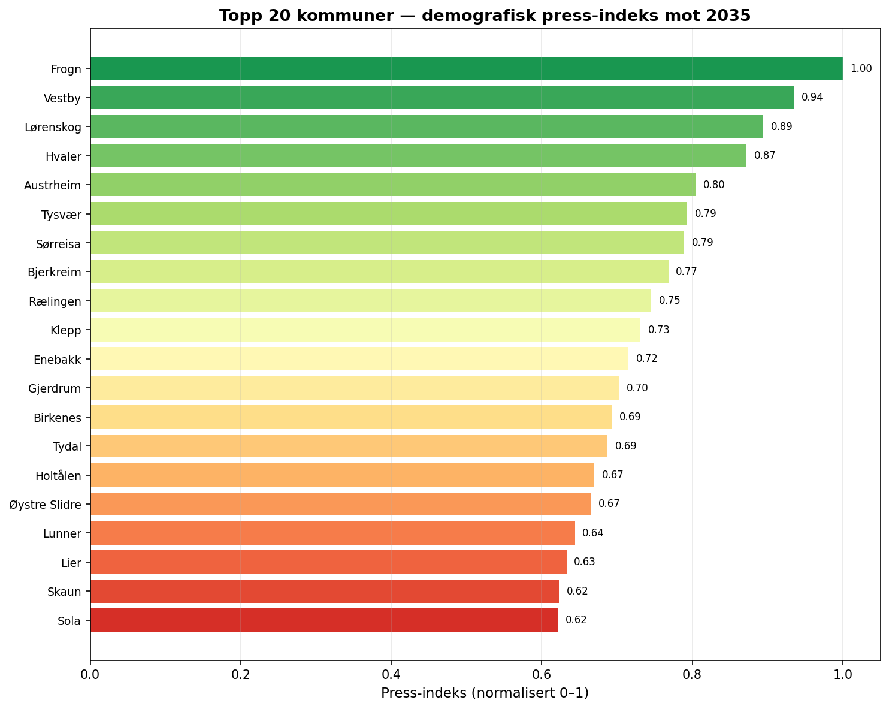
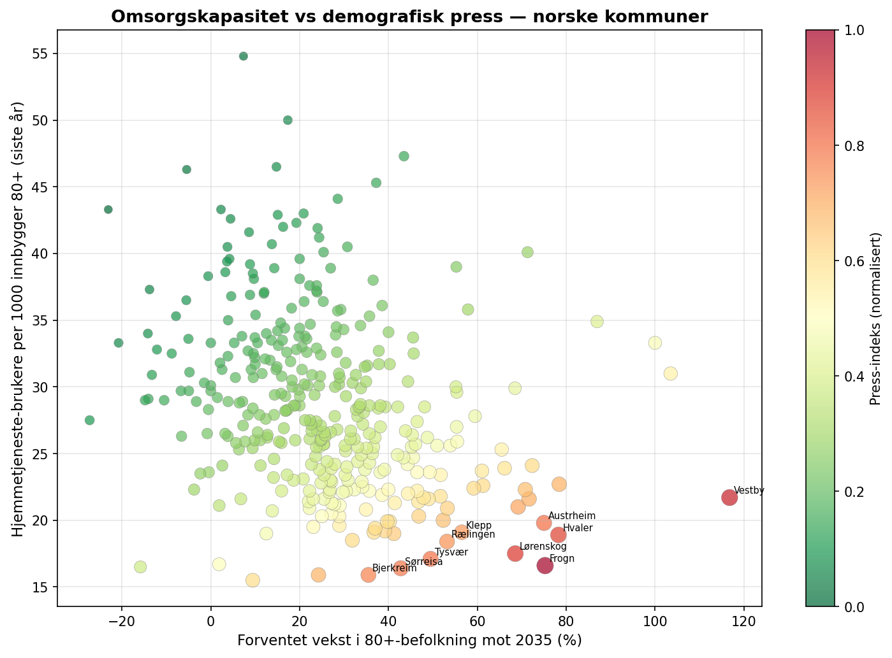
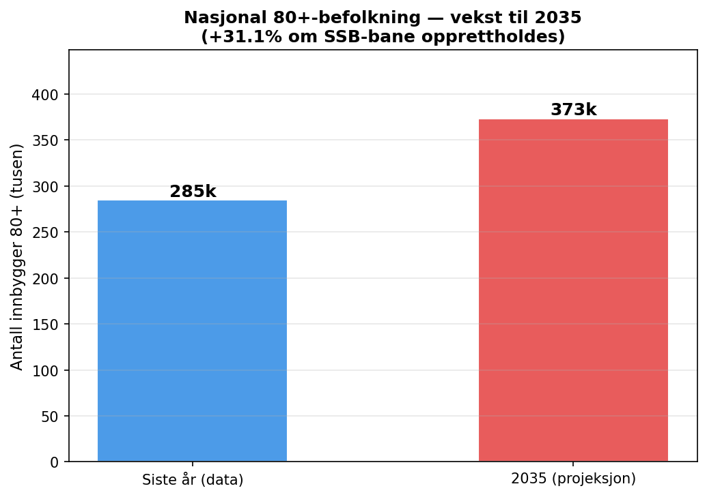
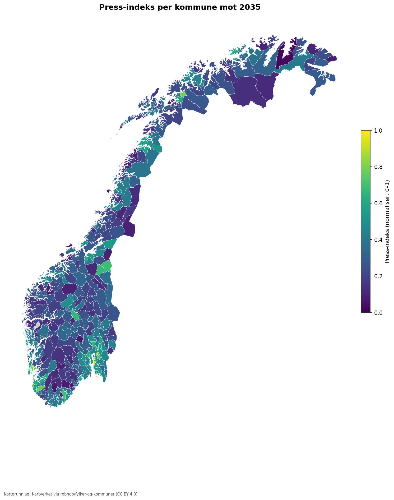

# Kommunal Omsorgsradar — rapport

*Analysedato: 2026-06-12 · Kilde: SSB KOSTRA + SSB befolkning · Versjon: 0.1.0*

---

## Sammendrag

Analysen rangerer **354 kommuner** (av 483 koderader — historiske kommunenummer og kommuner uten beregnbar dekningsgrad er ekskludert fra rangeringen) etter en press-indeks som kombinerer forventet vekst i 80+-befolkningen mot 2035 med dagens dekning av hjemmetjenester.

På nasjonalt nivå vokser 80+-befolkningen med anslagsvis **31.1%** fra 285 000 (siste datapunkt) til 373 000 i 2035 dersom hver kommunes historiske trend (2017–2026) fortsetter. Dette er en trendframskriving, ikke SSBs offisielle befolkningsframskriving: SSBs hovedalternativ (tabell 13599, alternativ MMM) gir til sammenligning **~46%** vekst for 80+ fra 2026 til 2035 — vesentlig raskere (se Begrensninger).

**50 kommuner** har press-indeks ≥ 0,5 og trenger særskilt planleggingsoppmerksomhet.
Gjennomsnittlig dekningsgrad er **29 %** (andel innbyggere 80+ som mottar hjemmetjenester).

---

## Metodikk og deskriptiv tolkning

Press-indeksen er et **deskriptivt planleggingsverktøy**, ikke et kausalt mål. Den beregnes som:

```
press_indeks_rå = (80+_befolkning_2035 / 80+_befolkning_nå) × (1 / (dekningsrate + ε))
press_indeks_norm = normalisert til [0, 1] på tvers av alle kommuner
```

Høy indeks = rask vekst i eldre befolkning OG lav dekning av hjemmetjenester i dag. Tolkes som planleggingsbehov, ikke som klinisk beslutningsstøtte.

---

## Rangering — topp 20 kommuner

| Rang | Kommune | Press-indeks | Dekningsrate | Vekst 80+ mot 2035 |
|------|---------|-------------|-------------|-------------------|
| 1 | Frogn | 1.000 | 17 | 75.2% |
| 2 | Vestby | 0.935 | 22 | 116.8% |
| 3 | Lørenskog | 0.894 | 18 | 68.5% |
| 4 | Hvaler | 0.872 | 19 | 78.3% |
| 5 | Austrheim | 0.804 | 20 | 75.0% |
| 6 | Tysvær | 0.793 | 17 | 49.5% |
| 7 | Sørreisa | 0.789 | 16 | 42.8% |
| 8 | Bjerkreim | 0.768 | 16 | 35.5% |
| 9 | Rælingen | 0.746 | 18 | 53.2% |
| 10 | Klepp | 0.731 | 19 | 56.5% |
| 11 | Enebakk | 0.715 | 21 | 69.2% |
| 12 | Gjerdrum | 0.703 | 22 | 71.6% |
| 13 | Birkenes | 0.693 | 23 | 78.4% |
| 14 | Tydal | 0.688 | 16 | 24.2% |
| 15 | Holtålen | 0.670 | 22 | 70.8% |
| 16 | Øystre Slidre | 0.665 | 20 | 52.3% |
| 17 | Lunner | 0.644 | 19 | 41.2% |
| 18 | Lier | 0.633 | 21 | 53.3% |
| 19 | Skaun | 0.623 | 19 | 39.1% |
| 20 | Sola | 0.621 | 20 | 46.8% |

---

## Figurer









*Kartgrunnlag: Kartverket via robhop/fylker-og-kommuner (CC BY 4.0). Kommuner uten data er vist i grått.*

---

## Datakvalitet

**kostra_pleie**: 39204 rader · 423 kommuner · kilde: SSB KOSTRA table 12209
**befolkning**: 237750 rader · 483 kommuner · kilde: SSB table 07459 — folkemengde etter alder
**framskrivinger**: 14 rader · N/A kommuner · kilde: SSB population projections
**fhi_nokkel**: 0 rader · 0 kommuner · kilde: FHI NOKKEL (folkehelsestatistikk)

---

## Verifisering av tall (verktøykvitteringer)

**Resultat: PASS** — 5/5 påstander verifisert.

- ✓ `top_kommune_rank1_press_index` → OK
- ✓ `top_kommune_name` → OK
- ✓ `national_growth_rate_2035` → OK
- ✓ `kommuner_above_threshold` → OK
- ✓ `coverage_rate_mean` → OK

---

## Begrensninger

Se [`LIMITATIONS.md`](../LIMITATIONS.md) for fullstendig liste. Viktigste forbehold: analysen er deskriptiv, ikke kausal; kommunesammenslåinger og omnummereringer håndteres via tabell regenerert fra SSB KLASS (t.o.m. 2024-bølgen, splittelser ekskludert); vekst per kommune er en trendframskriving (historisk CAGR 2017–2026 med vakter), ikke SSBs kommuneframskrivinger (tabell 13873 er ikke offentlig tilgjengelig).

---

*Rapporten er generert av omsorgsradar-pipeline v0.1.0.*
*Utdannet lege (master i medisin) — Oleksandr Altukhov.*
